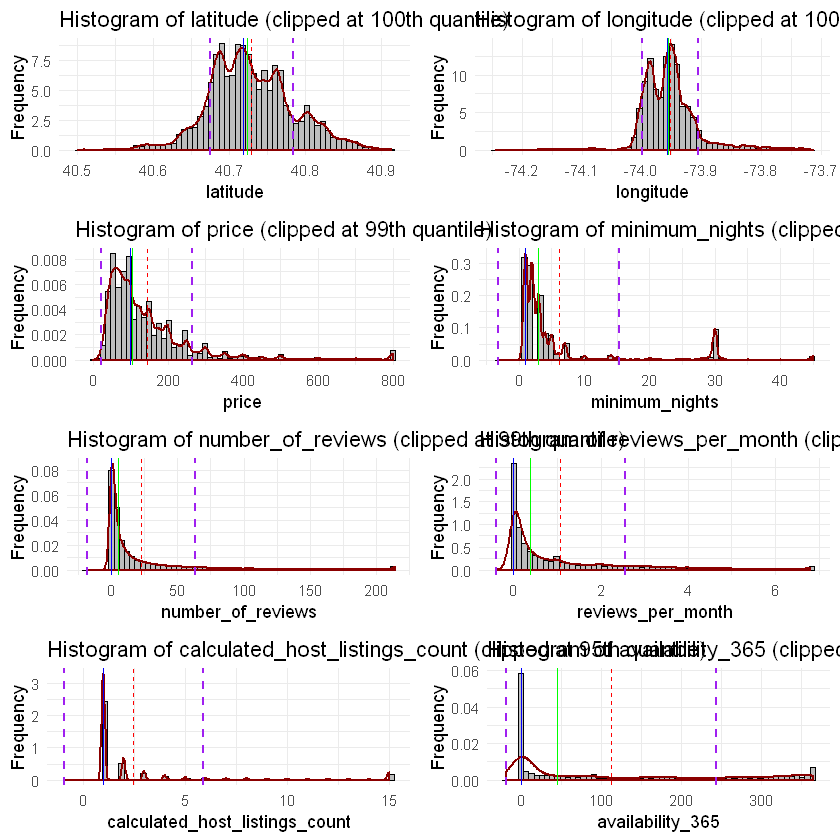
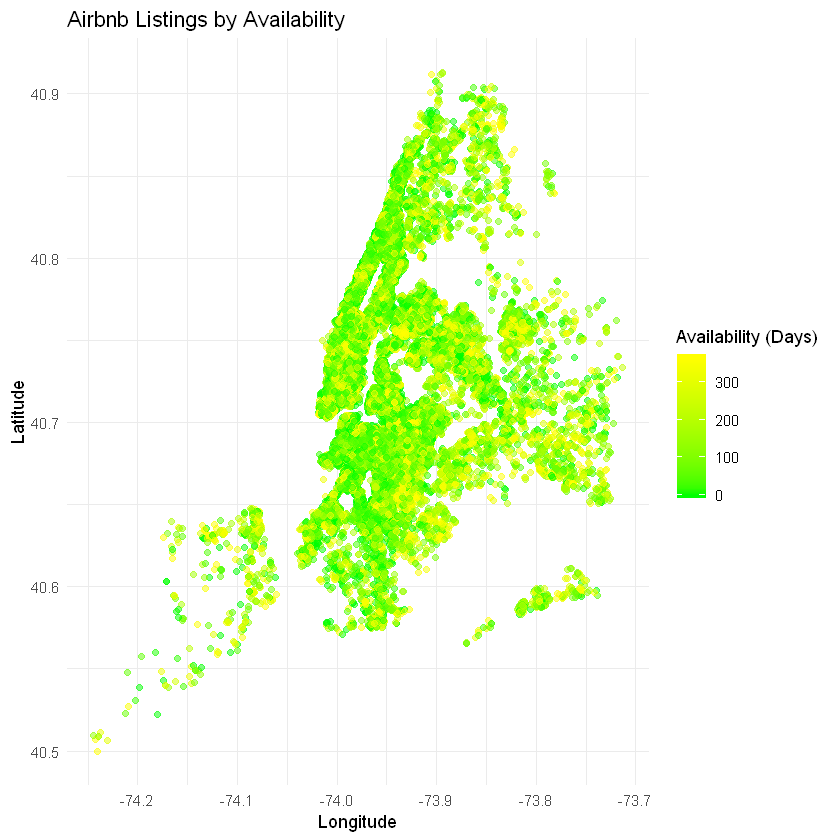
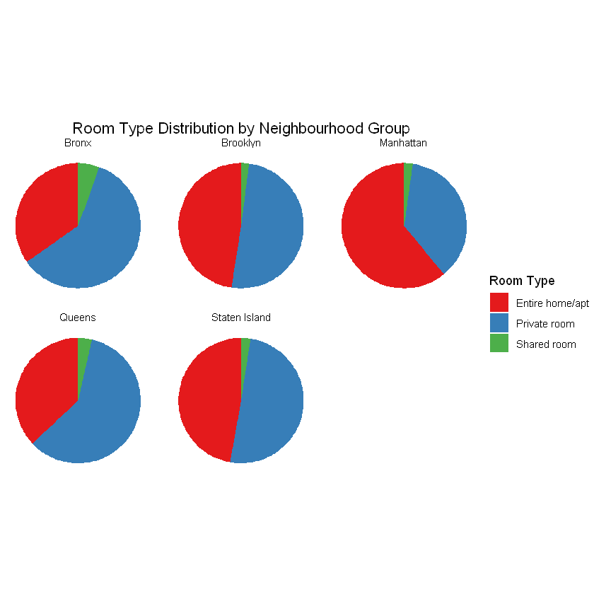
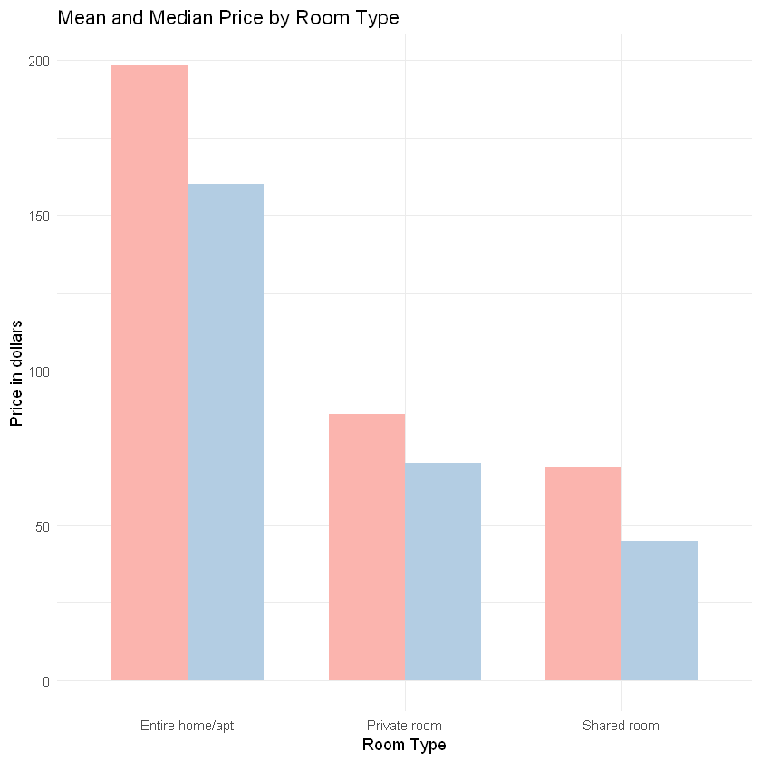
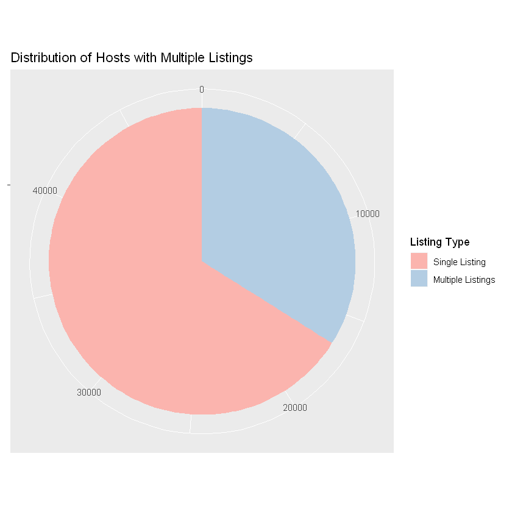
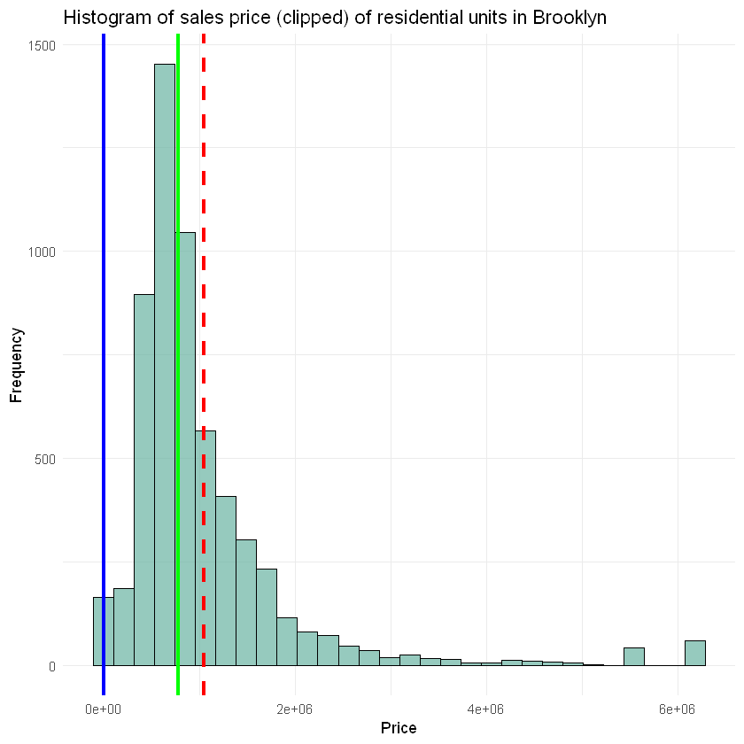

```R
library(readr)
library(dplyr)
library(ggplot2)
library(dplyr)
library(gridExtra)
library(corrplot)
library(randomForest)
library(tidyr)
```


```R
airbnb <- read_csv("AB_NYC_2019.csv")
```

    Parsed with column specification:
    cols(
      id = col_double(),
      name = col_character(),
      host_id = col_double(),
      host_name = col_character(),
      neighbourhood_group = col_character(),
      neighbourhood = col_character(),
      latitude = col_double(),
      longitude = col_double(),
      room_type = col_character(),
      price = col_double(),
      minimum_nights = col_double(),
      number_of_reviews = col_double(),
      last_review = col_date(format = ""),
      reviews_per_month = col_double(),
      calculated_host_listings_count = col_double(),
      availability_365 = col_double()
    )
    

# Airbnb in New York (2019)


```R
glimpse(airbnb)
```

    Observations: 48,895
    Variables: 16
    $ id                             <dbl> 2539, 2595, 3647, 3831, 5022, 5099, ...
    $ name                           <chr> "Clean & quiet apt home by the park"...
    $ host_id                        <dbl> 2787, 2845, 4632, 4869, 7192, 7322, ...
    $ host_name                      <chr> "John", "Jennifer", "Elisabeth", "Li...
    $ neighbourhood_group            <chr> "Brooklyn", "Manhattan", "Manhattan"...
    $ neighbourhood                  <chr> "Kensington", "Midtown", "Harlem", "...
    $ latitude                       <dbl> 40.64749, 40.75362, 40.80902, 40.685...
    $ longitude                      <dbl> -73.97237, -73.98377, -73.94190, -73...
    $ room_type                      <chr> "Private room", "Entire home/apt", "...
    $ price                          <dbl> 149, 225, 150, 89, 80, 200, 60, 79, ...
    $ minimum_nights                 <dbl> 1, 1, 3, 1, 10, 3, 45, 2, 2, 1, 5, 2...
    $ number_of_reviews              <dbl> 9, 45, 0, 270, 9, 74, 49, 430, 118, ...
    $ last_review                    <date> 2018-10-19, 2019-05-21, NA, 2019-07...
    $ reviews_per_month              <dbl> 0.21, 0.38, NA, 4.64, 0.10, 0.59, 0....
    $ calculated_host_listings_count <dbl> 6, 2, 1, 1, 1, 1, 1, 1, 1, 4, 1, 1, ...
    $ availability_365               <dbl> 365, 355, 365, 194, 0, 129, 0, 220, ...
    


```R
airbnb <- airbnb %>% select(-last_review)
```


```R
glimpse(airbnb)
```

    Observations: 48,895
    Variables: 15
    $ id                             <dbl> 2539, 2595, 3647, 3831, 5022, 5099, ...
    $ name                           <chr> "Clean & quiet apt home by the park"...
    $ host_id                        <dbl> 2787, 2845, 4632, 4869, 7192, 7322, ...
    $ host_name                      <chr> "John", "Jennifer", "Elisabeth", "Li...
    $ neighbourhood_group            <chr> "Brooklyn", "Manhattan", "Manhattan"...
    $ neighbourhood                  <chr> "Kensington", "Midtown", "Harlem", "...
    $ latitude                       <dbl> 40.64749, 40.75362, 40.80902, 40.685...
    $ longitude                      <dbl> -73.97237, -73.98377, -73.94190, -73...
    $ room_type                      <chr> "Private room", "Entire home/apt", "...
    $ price                          <dbl> 149, 225, 150, 89, 80, 200, 60, 79, ...
    $ minimum_nights                 <dbl> 1, 1, 3, 1, 10, 3, 45, 2, 2, 1, 5, 2...
    $ number_of_reviews              <dbl> 9, 45, 0, 270, 9, 74, 49, 430, 118, ...
    $ reviews_per_month              <dbl> 0.21, 0.38, NA, 4.64, 0.10, 0.59, 0....
    $ calculated_host_listings_count <dbl> 6, 2, 1, 1, 1, 1, 1, 1, 1, 4, 1, 1, ...
    $ availability_365               <dbl> 365, 355, 365, 194, 0, 129, 0, 220, ...
    


```R
numerical_cols <- c('latitude', 'longitude', 'price', 'minimum_nights', 'number_of_reviews', 
                    'reviews_per_month', 'calculated_host_listings_count', 'availability_365')

categorical_cols <- c('name', 'host_name', 'host_id', 'neighbourhood_group', 'neighbourhood', 
                      'room_type')
```

# Data pre-processing


```R
airbnb <- airbnb %>%
  mutate(host_name = ifelse(is.na(host_name), "Unknown", host_name),
         name = ifelse(is.na(name), "Unknown", name),
         reviews_per_month = ifelse(is.na(reviews_per_month), 0, reviews_per_month))

stopifnot(sum(is.na(airbnb)) == 0)
```

# Simple descriptive analysis


```R
plots <- list()

for (col in numerical_cols) {
  p <- ggplot(airbnb, aes_string(x = col)) +
    geom_histogram(aes(y = ..density..), bins = 30, fill = "#ADD8E6", color = "black", alpha = 0.7) +
    geom_density(color = "blue", size = 0.75, linetype = "solid") +
    labs(title = paste("Histogram of", col), x = col, y = "Density") +
    theme_minimal()
  plots[[col]] <- p
}

do.call(grid.arrange, c(plots, ncol = 2))
```


    

    


```R
plots <- list()
for (col in numerical_cols){
  p <- ggplot(airbnb, aes_string(x = factor(1), y = col)) +
    geom_violin(fill = "skyblue", color = "black") +
    labs(title = paste("Violin Plot of", col), x = "", y = col) +
    theme_minimal()
  plots[[col]] <- p}
do.call(grid.arrange, c(plots, ncol = 2))
```


    

    


```R
plots <- list()
for (col in numerical_cols) {
  p <- ggplot(airbnb, aes_string(x = factor(1), y = col)) +
    geom_boxplot(fill = "lightblue", color = "black") +
    labs(title = paste("Box Plot of", col), x = "", y = col) +
    theme_minimal()
  plots[[col]] <- p}

do.call(grid.arrange, c(plots, ncol = 2))
```


    

    


### Removing skewness & outliers for numerical columns


```R
cols_quantile <- list(
  latitude = 1,
  longitude = 1,
  price = 0.99,
  minimum_nights = 0.99,
  number_of_reviews = 0.99,
  reviews_per_month = 0.99,
  calculated_host_listings_count = 0.95,
  availability_365 = 0.99
)

plots <- list()
for (col in names(cols_quantile)) {
  upper_limit <- quantile(airbnb[[col]], probs = cols_quantile[[col]], na.rm = TRUE)
  data_clipped <- pmin(airbnb[[col]], upper_limit, na.rm = TRUE)
  airbnb[[col]] <- data_clipped
  
  mean_val <- mean(data_clipped, na.rm = TRUE)
  median_val <- median(data_clipped, na.rm = TRUE)
  mode_val <- as.numeric(names(sort(-table(data_clipped)))[1])
  std_dev_val <- sd(data_clipped, na.rm = TRUE)
  
  p <- ggplot(data.frame(data_clipped), aes(x = data_clipped)) +
    geom_histogram(aes(y = ..density..), bins = 60, fill = "gray", color = "black") +
    geom_density(color = "darkred", size = 0.75) +
    geom_vline(xintercept = mean_val, color = "red", linetype = "dashed", size = 0.25) +
    geom_vline(xintercept = median_val, color = "green", size = 0.5) +
    geom_vline(xintercept = mode_val, color = "blue", size = 0.5) +
    geom_vline(xintercept = mean_val + std_dev_val, color = "purple", linetype = "dashed", size = 0.75) +
    geom_vline(xintercept = mean_val - std_dev_val, color = "purple", linetype = "dashed", size = 0.75) +
    labs(title = sprintf("Histogram of %s (clipped at %dth quantile)", col, cols_quantile[[col]] * 100),
         x = col, y = "Frequency") +
    theme_minimal() + theme(legend.position = "bottom")
  
  plots[[col]] <- p}

do.call(grid.arrange, c(plots, ncol = 2))
```


    

    


### Log-normality of price


```R
price_clipped <- pmin(airbnb$price, quantile(airbnb$price, 0.99), na.rm = TRUE)

log_price <- log(price_clipped[price_clipped > 0])

bin_sizes <- c(15, 30, 60, 90)

plots <- list()
for (i in seq_along(bin_sizes)) {
  bins <- bin_sizes[i]
  mean_log_price <- mean(log_price, na.rm = TRUE)
  median_log_price <- median(log_price, na.rm = TRUE)
  mode_log_price <- as.numeric(names(sort(-table(log_price)))[1])
  std_dev <- sd(log_price, na.rm = TRUE)
  
  p <- ggplot(data.frame(log_price), aes(x = log_price)) +
    geom_histogram(aes(y = ..density..), bins = bins, fill = "gray", color = "black") +
    geom_density(color = "darkred", size = 0.75) +
    geom_vline(xintercept = mean_log_price, color = "red", linetype = "dashed", size = 0.75) +
    geom_vline(xintercept = median_log_price, color = "green", size = 0.75) +
    geom_vline(xintercept = mode_log_price, color = "blue", size = 0.75) +
    geom_vline(xintercept = mean_log_price + std_dev, color = "purple", linetype = "dashed", size = 0.75) +
    geom_vline(xintercept = mean_log_price - std_dev, color = "purple", linetype = "dashed", size = 0.75) +
    labs(title = sprintf("Histogram of log-transformed price (clipped at 99th percentile) with %s bins", bins),
         x = "log(price)", y = "Frequency") +
    theme_minimal() +
    theme(legend.position = "bottom")
  plots[[i]] <- p}
do.call(gridExtra::grid.arrange, c(plots, ncol = 2))
```


    

    


```R
qqnorm(log_price, main = "Q-Q Plot of log-transformed price", pch = 1, col = "blue", cex = 1.2)
qqline(log_price, col = "red", lwd = 2)
```


    

    


### Visualize counts of categorical columns


```R
plots <- list()
for (i in seq_along(categorical_cols)) {
  col <- categorical_cols[i]
  data <- airbnb %>%
    filter(!is.na(.data[[col]])) %>%
    count(!!sym(col)) %>%
    arrange(desc(n)) %>%
    mutate(perc = n / sum(n) * 100) %>%
    top_n(10, wt = n)

  p <- ggplot(data, aes(x = reorder(!!sym(col), n), y = perc, fill = as.factor(!!sym(col)))) +
    geom_bar(stat = "identity") + coord_flip() +
    labs(title = if (nrow(data) > 10) paste("Top 10 Count Plot of", col, "(in %)")
         else paste("Count Plot of", col, "(in %)"),
         x = "Percentage",
         y = col) +
    theme_minimal() +
    theme(legend.position = "none")
  
  plots[[i]] <- p}
do.call(gridExtra::grid.arrange, c(plots, ncol = 2))
```


    

    


```R
neighbourhood_group_counts <- table(airbnb$neighbourhood_group)
neighbourhood_group_data <- as.data.frame(neighbourhood_group_counts)
names(neighbourhood_group_data) <- c("group", "count")

room_type_counts <- table(airbnb$room_type)
room_type_data <- as.data.frame(room_type_counts)
names(room_type_data) <- c("type", "count")

p1 <- ggplot(neighbourhood_group_data, aes(x = "", y = count, fill = group)) +
  geom_bar(width = 1, stat = "identity") +
  coord_polar(theta = "y") +
  labs(title = "Pie Chart of Neighbourhood Group", x = NULL, y = NULL, fill = "Neighbourhood Group") +
  theme_void() +
  theme(legend.position = "right",
        plot.title = element_text(hjust = 0.5))

p2 <- ggplot(room_type_data, aes(x = "", y = count, fill = type)) +
  geom_bar(width = 1, stat = "identity") +
  coord_polar(theta = "y") +
  labs(title = "Pie Chart of Room Type", x = NULL, y = NULL, fill = "Room Type") +
  theme_void() +
  theme(legend.position = "right",
        plot.title = element_text(hjust = 0.5))

grid.arrange(p1, p2, nrow = 2)
```


    

    


```R
correlation_matrix <- cor(airbnb[numerical_cols], use = "pairwise.complete.obs")

corrplot(correlation_matrix, method = "color", 
         type = "full",
         tl.col = "black",
         tl.srt = 45,
         title = "The correlation Matrix for Numeric Columns",
         col = colorRampPalette(c("blue", "white", "red"))(200))
```


    

    


```R
ggplot(airbnb, aes(x = longitude, y = latitude, color = neighbourhood_group)) +
  geom_point(alpha = 0.6, size = 1) +
  scale_color_brewer(palette = "Set1") +
  labs(title = "Scatter Plot of Airbnb Listings by Neighbourhood Group",
       x = "Longitude", y = "Latitude") + theme_minimal() + theme(legend.position = "right")
```


    

    


```R
ggplot(airbnb, aes(x = longitude, y = latitude, color = price)) +
  geom_point(alpha = 0.5) +
  scale_color_gradient(low = "blue", high = "red") +
  labs(title = "Airbnb locations by price",
       x = "Longitude", y = "Latitude", color = "Price") +
  theme_minimal() + theme(legend.position = "right")
```


    

    


```R
ggplot(airbnb, aes(x = longitude, y = latitude, color = availability_365)) +
  geom_point(alpha = 0.5) +
  scale_color_gradient(low = "green", high = "yellow") +
  labs(title = "Airbnb Listings by Availability",
       x = "Longitude", y = "Latitude", color = "Availability (Days)") +
  theme_minimal() + theme(legend.position = "right")
```


    

    


### Counts by neighbourhood groups


```R
ggplot(airbnb, aes(x = neighbourhood_group, fill = room_type)) +
  geom_bar(position = "dodge") + 
  scale_fill_brewer(palette = "Set1") + 
  labs(title = "Frequency Count of Room Type by Neighbourhood Group",
       x = "Neighbourhood Group", y = "Count", fill = "Room Type") +
  theme_minimal()
```


    

    


```R
airbnb_counts <- airbnb %>%
  count(neighbourhood_group, room_type) %>%
  group_by(neighbourhood_group) %>%
  mutate(prop = n / sum(n))

ggplot(airbnb_counts, aes(x = "", y = prop, fill = room_type)) +
  geom_bar(stat = "identity", width = 1) +
  coord_polar(theta = "y") +
  facet_wrap(~neighbourhood_group) +
  scale_fill_brewer(palette = "Set1") +
  labs(title = "Room Type Distribution by Neighbourhood Group",
       x = NULL,
       y = NULL,
       fill = "Room Type") +
  theme_void() +
  theme(legend.position = "right",
        plot.title = element_text(hjust = 0.5))
```


    

    


```R
mean_prices <- airbnb %>%
  group_by(neighbourhood_group) %>%
  summarise(price = mean(price, na.rm = TRUE)) %>%
  mutate(stat = "Mean")

median_prices <- airbnb %>%
  group_by(neighbourhood_group) %>%
  summarise(price = median(price, na.rm = TRUE)) %>%
  mutate(stat = "Median")

prices <- bind_rows(mean_prices, median_prices)

plot <- ggplot(prices, aes(x = neighbourhood_group, y = price, fill = stat)) +
  geom_bar(stat = "identity", position = position_dodge(), width = 0.7) +
  scale_fill_brewer(palette = "Pastel1", name = "Statistics") +
  labs(title = "Mean and Median Price by Neighbourhood Group",
       x = "Neighbourhood Group", y = "Price") +
  theme_minimal() + theme(legend.position = "top")

print(plot)
```


    

    


```R
ggplot(prices, aes(x = room_type, y = price, fill = stat)) +
  geom_bar(stat = "identity", position = position_dodge(), width = 0.7) +
  scale_fill_brewer(palette = "Pastel1", name = "Statistic") +
  labs(title = "Mean and Median Price by Room Type",
       x = "Room Type", y = "Price in dollars") +
  theme_minimal() + theme(legend.position = "upper right")
```


    

    


```R
mean_price <- airbnb %>%
  group_by(neighbourhood_group, room_type) %>%
  summarise(price = mean(price, na.rm = TRUE)) %>%
  ungroup()

ggplot(mean_price, aes(x = neighbourhood_group, y = price, fill = room_type)) +
  geom_bar(stat = "identity", position = position_dodge(), width = 0.7) +
  scale_fill_brewer(palette = "Pastel1", name = "Room Type") +
  labs(title = "Mean Price by Neighbourhood Group and Room Type",
       x = "Neighbourhood Group", y = "Price") +
  theme_minimal() + theme(legend.position = "top")
```


    

    


### Analysis by host


```R
airbnb$multiple_listings <- airbnb$calculated_host_listings_count > 1

multiple_listings_counts <- table(airbnb$multiple_listings)

multiple_listings_df <- as.data.frame(multiple_listings_counts)
names(multiple_listings_df) <- c("multiple_listings", "count")

ggplot(multiple_listings_df, aes(x = "", y = count, fill = factor(multiple_listings))) +
  geom_bar(stat = "identity", width = 1) + coord_polar(theta = "y") +
  scale_fill_brewer(palette = "Pastel1", labels = c("Single Listing", "Multiple Listings"), name = "Listing Type") +
  labs(title = "Distribution of Hosts with Multiple Listings", x = NULL, y = NULL)
```


    

    


```R
airbnb$multiple_listings <- airbnb$calculated_host_listings_count > 3

multiple_listings_counts <- table(airbnb$multiple_listings)

multiple_listings_df <- as.data.frame(multiple_listings_counts)
names(multiple_listings_df) <- c("multiple_listings", "count")
multiple_listings_df$multiple_listings <- factor(multiple_listings_df$multiple_listings, labels = c("≤ 3 Listings", "> 3 Listings"))

ggplot(multiple_listings_df, aes(x = "", y = count, fill = multiple_listings)) +
  geom_bar(stat = "identity", width = 1) +
  coord_polar(theta = "y") + scale_fill_brewer(palette = "Pastel1") +
  labs(title = "Distribution of Hosts with More than 3 Listings", x = NULL, y = NULL)
```


    

    


```R
host_listing_counts <- airbnb %>%
  group_by(host_id) %>%
  summarise(max_listings = max(calculated_host_listings_count)) %>%
  ungroup() %>%
  mutate(host_multiple_listings = max_listings > 1)

airbnb <- airbnb %>%
  left_join(host_listing_counts %>% select(host_id, host_multiple_listings), by = "host_id")

average_price_by_listing_count <- airbnb %>%
  group_by(host_multiple_listings) %>%
  summarise(price = mean(price, na.rm = TRUE)) %>%
  mutate(host_multiple_listings = ifelse(host_multiple_listings, "Multiple Listings", "Single Listing")) %>%
  ungroup()

average_price_by_listing_count$host_multiple_listings <- factor(average_price_by_listing_count$host_multiple_listings,
                                                               levels = c("Single Listing", "Multiple Listings"))

ggplot(average_price_by_listing_count, aes(x = host_multiple_listings, y = price, fill = host_multiple_listings)) +
  geom_bar(stat = "identity", position = "dodge") +
  scale_fill_brewer(palette = "Pastel1", name = "Listing Type") +
  labs(title = "Average Price by Hosts with Multiple Listings vs Single Listing",
       x = "Host Listing Type", y = "Average Price") + theme_minimal()
```


    

    


# Demographics


```R
airbnb <- airbnb %>% mutate(occupancy = 365 - availability_365, revenue = price * occupancy)
average_revenue <- airbnb %>% group_by(neighbourhood_group, room_type) %>% summarise(revenue = mean(revenue, na.rm = TRUE), .groups = 'drop')
airbnb <- airbnb %>% mutate(occupancy = 365 - availability_365, revenue = price * occupancy)
average_revenue <- airbnb %>% group_by(neighbourhood_group, room_type) %>% summarise(revenue = mean(revenue, na.rm = TRUE), .groups = 'drop')

ggplot(average_revenue, aes(x = neighbourhood_group, y = revenue, fill = room_type)) +
  geom_bar(stat = "identity", position = position_dodge()) +
  scale_fill_brewer(palette = "Pastel1") +
  labs(title = "Average Revenue by Room Type and Neighbourhood Group",
       x = "NYC Neighbourhood", y = "Average Revenue", fill = "Room Type") +
  theme_minimal() + theme(legend.position = "top")
```


    

    


```R
calculate_average_revenue_at_occupancy <- function(data, occupancy_levels) {
  results <- list()
  for (level in occupancy_levels) {
    data$occupancy_days <- 365 * level
    data$revenue <- data$price * data$occupancy_days
    average_revenue <- data %>%
      group_by(neighbourhood_group) %>%
      summarise(revenue = mean(revenue, na.rm = TRUE)) %>%
      mutate(occupancy_level = paste0(as.integer(level * 100), "%")) %>%
      ungroup()
    results[[length(results) + 1]] <- average_revenue}
  
  do.call(rbind, results)}

occupancy_levels <- c(0.25, 0.50, 0.75, 1.00)
average_revenue_at_occupancy <- calculate_average_revenue_at_occupancy(airbnb, occupancy_levels)

ggplot(average_revenue_at_occupancy, aes(x = neighbourhood_group, y = revenue, fill = occupancy_level)) +
  geom_bar(stat = "identity", position = position_dodge()) +
  scale_fill_brewer(palette = "Pastel1") +
  labs(title = "Average Revenue by Neighbourhood Group at Different Occupancy Levels",
       x = "Neighbourhood Group", y = "Average Revenue", fill = "Occupancy Level") +
  theme_minimal() + theme(legend.position = "top")
```


    

    


```R
calculate_revenue_at_occupancy <- function(data, occupancy_levels) {
  results <- list()
  for (level in occupancy_levels) {
    if (level == -1) {
      data$occupancy_days <- 365 - data$availability_365
      data$revenue <- data$price * data$occupancy_days
      data$occupancy_level <- "Real"} else {
      data$occupancy_days <- 365 * level
      data$revenue <- data$price * data$occupancy_days
      data$occupancy_level <- paste0(as.integer(level * 100), "%")}
    results[[length(results) + 1]] <- data}
  
  return(do.call(rbind, results))}

revenue_at_occupancy <- calculate_revenue_at_occupancy(airbnb, occupancy_levels)
manhattan_revenue <- filter(revenue_at_occupancy, neighbourhood_group == "Manhattan")

plots <- lapply(unique(manhattan_revenue$occupancy_level), function(level) {
  ggplot(filter(manhattan_revenue, occupancy_level == level), aes(x = revenue)) +
    geom_histogram(bins = 30, fill = "blue", color = "black", alpha = 0.7) +
    geom_density(alpha = .2, fill = "#FF6666") +
    labs(title = paste("Revenue Distribution at", level, "Occupancy"),
         x = "Revenue", y = "Frequency") + theme_minimal()})

do.call(grid.arrange, c(plots, ncol = 2))
```


    

    


### How many properties are not occupied at all in Manhattan?


```R
airbnb$occupancy <- 365 - airbnb$availability_365

manhattan_data <- filter(airbnb, neighbourhood_group == 'Manhattan')

not_occupied_count <- sum(manhattan_data$occupancy == 0)
occupied_count <- sum(manhattan_data$occupancy > 0)

occupancy_counts <- data.frame(
  Status = c("Not Occupied", "Occupied"),
  Count = c(not_occupied_count, occupied_count))

occupancy_counts$Status <- factor(occupancy_counts$Status)

ggplot(occupancy_counts, aes(x = "", y = Count, fill = Status)) +
  geom_bar(stat = "identity", width = 1) +
  coord_polar(theta = "y") +
  scale_fill_brewer(palette = "Pastel1") +
  labs(title = "Distribution of Properties Not Occupied at All in Manhattan") +
  theme_void() + theme(legend.position = "right", legend.title = element_blank())
```


    

    


```R
brooklyn_sales <- read_csv('2019_Brooklyn.csv')
manhattan_sales <- read_csv('2019_Manhattan.csv')
```

    Parsed with column specification:
    cols(
      .default = col_double(),
      Neighborhood = col_character(),
      `Building Class Category` = col_character(),
      `Tax Class At Present` = col_character(),
      `Ease-Ment` = col_logical(),
      `Building Class At Present` = col_character(),
      Address = col_character(),
      `Apartment Number` = col_character(),
      `Building Class At Time Of Sale` = col_character(),
      `Sale Date` = col_datetime(format = "")
    )
    See spec(...) for full column specifications.
    Parsed with column specification:
    cols(
      .default = col_double(),
      Neighborhood = col_character(),
      `Building Class Category` = col_character(),
      `Tax Class As Of Final Roll 18/1` = col_character(),
      `Ease-Ment` = col_logical(),
      `Building Class As Of Final Roll 18/1` = col_character(),
      Address = col_character(),
      `Apartment Number` = col_character(),
      `Building Class At Time Of Sale` = col_character(),
      `Sale Date` = col_datetime(format = "")
    )
    See spec(...) for full column specifications.
    


```R
sales_price <- brooklyn_sales %>%
  filter(`Residential Units` == 1, `Sale Price` > 0) %>%
  pull(`Sale Price`) %>%
  na.omit()

quantile_99 <- quantile(sales_price, 0.99)
sales_price <- pmin(sales_price, quantile_99)

mean_price <- mean(sales_price)
median_price <- median(sales_price)
mode_price <- as.numeric(names(sort(-table(sales_price)))[1])
std_dev <- sd(sales_price)

ggplot(data = data.frame(sales_price), aes(x = sales_price)) +
  geom_histogram(bins = 30, fill = "#69b3a2", color = "black", alpha = 0.7) +
  geom_density(alpha = .2, fill = "#FF6666") +
  geom_vline(xintercept = mean_price, color = "red", linetype = "dashed", size = 1.2, show.legend = TRUE) +
  geom_vline(xintercept = median_price, color = "green", linetype = "solid", size = 1.2, show.legend = TRUE) +
  geom_vline(xintercept = mode_price, color = "blue", linetype = "solid", size = 1.2, show.legend = TRUE) +
  labs(title = "Histogram of sales price (clipped) of residential units in Brooklyn",
       x = "Price", y = "Frequency") + theme_minimal() + guides(colour = guide_legend(title = "Statistics"))
```


    

    


```R
sales_price <- manhattan_sales %>%
  filter(`Residential Units` == 1, `Sale Price` > 0) %>%
  pull(`Sale Price`) %>%
  na.omit()

quantile_99 <- quantile(sales_price, 0.99)
sales_price <- pmin(sales_price, quantile_99)

mean_price <- mean(sales_price)
median_price <- median(sales_price)
mode_price <- as.numeric(names(sort(-table(sales_price)))[1])
std_dev <- sd(sales_price)

ggplot(data = data.frame(sales_price), aes(x = sales_price)) +
  geom_histogram(bins = 30, fill = "#69b3a2", color = "black", alpha = 0.7) +
  geom_density(alpha = .2, fill = "#FF6666") +
  geom_vline(xintercept = mean_price, color = "red", linetype = "dashed", size = 1.2, show.legend = TRUE) +
  geom_vline(xintercept = median_price, color = "green", linetype = "solid", size = 1.2, show.legend = TRUE) +
  geom_vline(xintercept = mode_price, color = "blue", linetype = "solid", size = 1.2, show.legend = TRUE) +
  labs(title = "Histogram of sales price (clipped) of residential units in Manhattan",
       x = "Price", y = "Frequency") + theme_minimal() + guides(colour = guide_legend(title = "Statistics"))
```


    

    


```R

```
